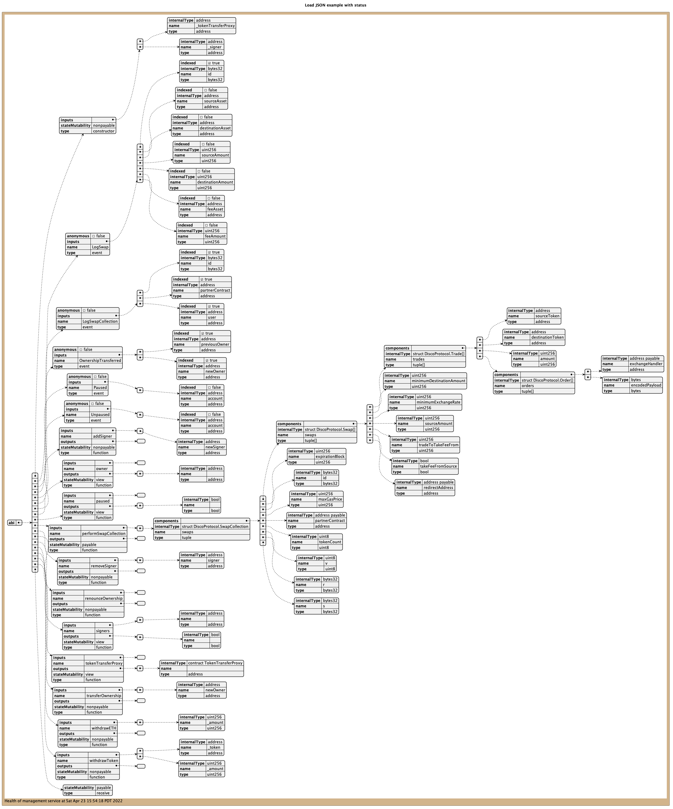

# UML ABI


  <pre>
      @ startuml
      ' loads a local file
      !$JSON_LOCAL_RELATIVE=%loadJSON("file.json")
 
      ' loads a local file from an absolute file path
      !$JSON_LOCAL_ABS=%loadJSON("c:/loaded/data/file.json")
 
      ' tries to load a local file and returns an empty JSON
      !$JSON_LOCAL_REL_EMPTY=%loadJSON("file-not-existing.json")
 
      ' tries to load a local file and returns an default JSON
      !$DEF_JSON={"status":"No data found"}
      !$JSON_LOCAL_REL_DEF=%loadJSON("file-not-existing.json", $DEF_JSON)
 
      ' loads a local file with a specific charset (default is UTF-8)
      !$JSON_LOCAL_RELATIVE_CHARSET=%loadJSON("file.json", "{}", "iso-8859-1")
 
      ' loads a remote JSON from an endpoint (and default, if not reachable)
      !$STATUS_NO_CONNECTION={"status": "No connection"}
      !$JSON_REMOTE_DEF=%loadJSON("https://localhost:7778/management/health", $STATUS_NO_CONNECTION)
      status -> $JSON_REMOTE_DEF.status
      @ enduml
  </pre>

## Usage

Run

```shell
./build.sh
```


## Example

